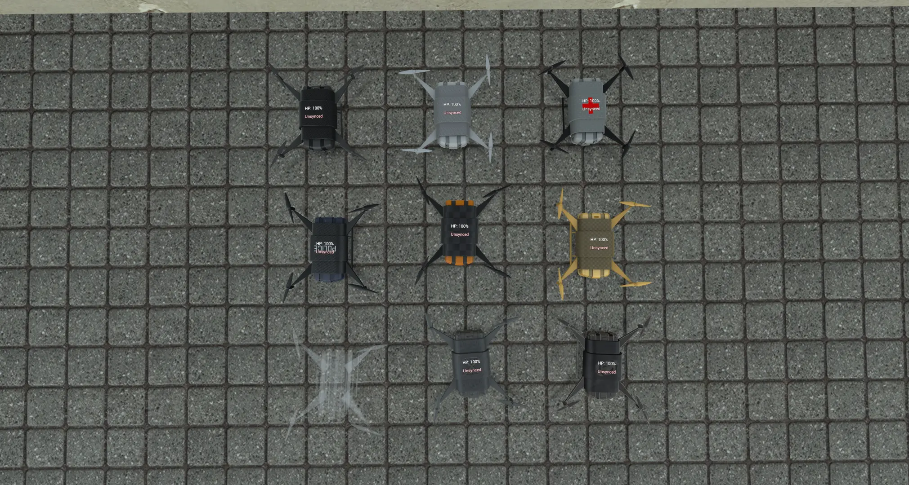
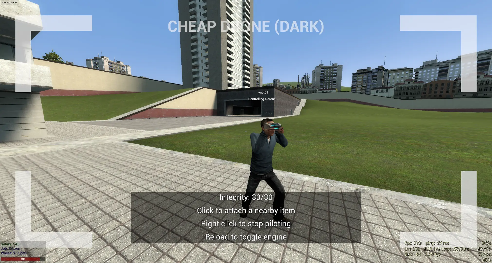

# yDrones

yDrones is a generic drone addon that I made specifically to resolve the "too distant" problem.

In most popular drone addons, you will start to experience glitches like loss of visuals or sound when your drone goes far. Some addons try to fix this by adding your PVS, but it is described to be an unavoidable source engine problem.

I took this as a challenge, and so births yDrones. It "just works" by physically sticking your player to the drone for the duration of the flight. When you start piloting a drone, you will be made very tiny, invincible, and invisible. At the same time, an NPC will be dropped at your original position, and if it takes any damage, you will be forcibly ejected from the drone and take that damage yourself.

By having the player follow around the drone, the player will be guaranteed to receive all information that the drone does with no jank attached. As an unintended bonus, other things like voice/text proximity and opening doors should also follow the drone around.

# Tutorial

Grab a `weapon_ydrones_remote` and click (primary fire) at a drone to sync with it. Reload to start the engine, and right click to pilot the drone.

You can stop piloting the drone at any time and as long as the engine is on it will hover. If you die or unsync with the drone, anyone will be able to sync with it after and control it

Primary fire while piloting a drone will grab cargo or fire its weapon

# Firepower

Certain drones will be equipped with weak weaponry, which can either damage opponents or heal allies

# Cargo

All drones without weaponry will instead be able to carry physical items

Efficiency at this task depends on speed and weight of the drone and the weight of the item, but be cautious as heavier drones can prove more difficult to control

# Configuration

All drone entities can be easily configured in their `shared.lua` files

#

Requires [Av Drones (Models & Textures)](https://steamcommunity.com/sharedfiles/filedetails/?id=1991832497) to be installed

I am not affiliated with [AVDrones](https://www.gmodstore.com/market/view/avdrones-drone-system), nor do I know what it does exactly, but I recommend checking out the addon, as it is a paid product so it is likely much higher quality and has more features than this